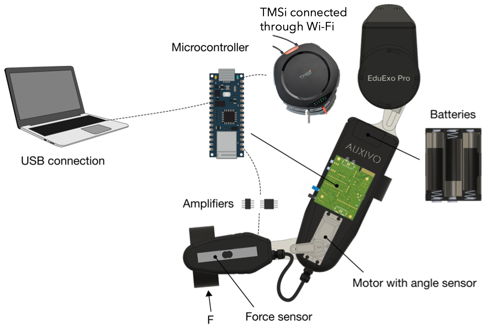
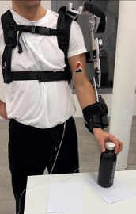

# Collaborative-Robotics-Post-Stroke-Rehabilitation-EMG-Driven-Portable-Exoskeleton

As one of leading causes of severe long-term disability, stroke affects approximately 795000 new individuals annually. The degree of impairment in activities of daily living depends significantly on the brain trauma position and size, posing challenges for patients, their families and society at large. Many post-stroke patients can regain some capabilities after rehabilitation training, but the effectiveness is often limited by the availability and expertise of human physical therapists. Wearable rehabilitation robots have the potential to automate the training process such that stroke survivors recover the capabilities they should. Compared with conventional treatment, robot-assisted movements had advantages in terms of clinical and biomechanical measures.

In this project we programmed an [EduExo Pro exoskeleton](https://www.auxivo.com/eduexo-pro) for post-stroke rehabilitation. The device assists the user in performing elbow flexion–extension movements and is triggered by the activation of the biceps via EMG signals. A gravity compensation approach is implemented to allow patients to perform the rehabilitation exercise more effectively and efficiently.

## REQUIREMENT

### Software
Please download the [TMSi Python Interface](https://gitlab.com/tmsi/tmsi-python-interface)
### Hardware
- AUXIVO EduExo Pro
- TMSi SAGA device 
- Ag/AgCl wet-gel pediatric electrodes


## USAGE

- Place Ag/AgCl wet-gel pediatric electrodes on the biceps brachii with the closest possible inter-electrode distance to increase selectivity (2 cm is recommended) [14]. Moreover, a reference electrode needs to be positioned on an electrically unaffected area such as the wrist bone 
- Run python script ```Real_time_EMG.py``` and Arduino script ```EduExo.ino```, after uploading it on the Arduino in the AUXIVO EduExo Pro exoskeleton
- User should be still for the first 15 seconds (EMG signal baseline computation). After baseline computation, user can start to perform the exercise
<p align="center">
  
</p>

## EXTRA
The folder [Validation](Codes/Validation) cointains code used for testing and validation (EMG trigger, gravity compensation and force sensor validation) 

## AUTHORS

This project was realized during [Collaborative robotics course](https://onlineservices.polimi.it/manifesti/manifesti/controller/Main.do?EVN_DETTAGLIO_RIGA_MANIFESTO=evento&aa=2025&k_cf=225&k_corso_la=479&k_indir=DBI&codDescr=059411&lang=EN&semestre=1&idGruppo=5127&idRiga=320617&caricaOffertaInvisibile=false) at [Politecnico di Milano](https://www.polimi.it/) by:

- Alessia Bini 
- Francesca Iustini 
- Matteo Magnani 
- Gianluca Morotti 
- Michele Tucci 


